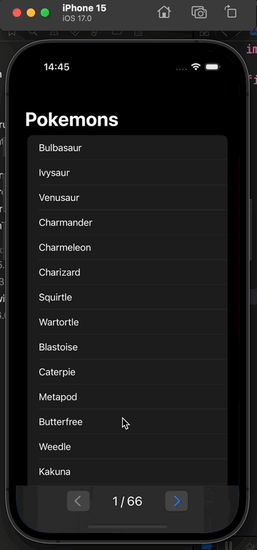

# Pokemon App

The app serves to display list of pokemons and view detailed information about them. Exploited features:

- list pagination.
- dark and light modes are supported.
- offline mode due to request caching.

## Stack of technologies

- SwiftUI
- Clean + Coordinator
- Modern concurrency
- Testing using XCTest
- Moya (will be removed)

## Dev environment

  
